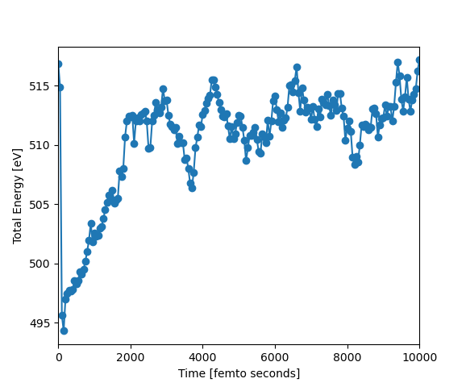
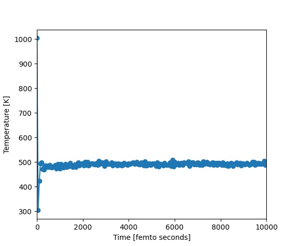
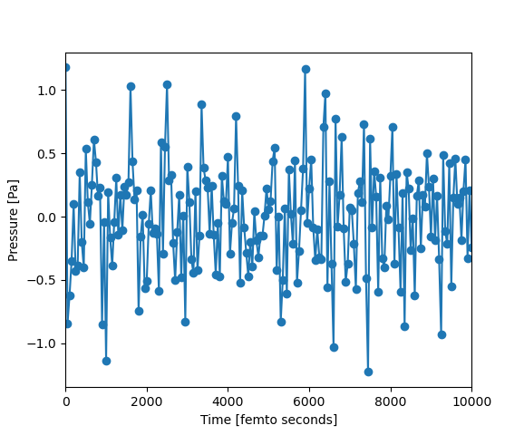
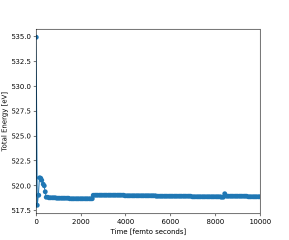
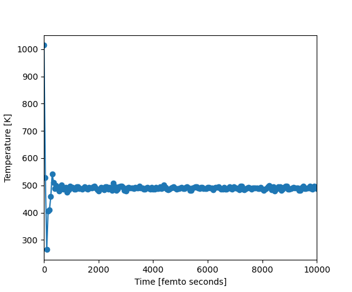
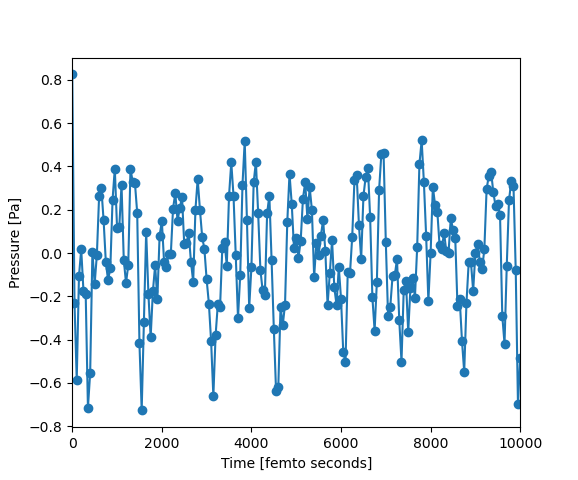

.. Computational Physics Project documentation master file, created by
   sphinx-quickstart on Mon Dec  4 13:06:56 2023.
   You can adapt this file completely to your liking, but it should at least
   contain the root `toctree` directive.

Welcome to Computational Physics Project's documentation!
=========================================================

.. toctree::
   :maxdepth: 2
   :caption: Contents:

This is the documentation page for the Computational Physics Project in the course TFYA99 at Linköping University.
To see the documentation for the different modules of the software, click on "index".

Run the program
---------------
| To start the molecular dynamics program, run the following command in the terminal: 

```
python3 User_interface/user_interface.py
```

Tests
=====
In order to verify the simulations, as well as all implemented properties, a number of tests were performed. These tests include unit-tests which were performed on every individual function that calculates a specific property of the system, as well as larger system tests, which ran simulations and tested all implemented properties. In order to verify that the results were reasonable, the calculated values were compared to reference values from Physics Handbook and other online sources. It was made sure that the simulations reached equillibrium. Below are the results from the larger system tests.

NVT Simulations
-----------
Tests were run with the following simulation parameters

.. list-table:: NVT settings
   :widths: 50 50
   :header-rows: 1

   * - Setting name
     - Chosen setting
   * - Ensemble
     - NVT
   * - Temperature
     - 500
   * - Potential
     - EMT
   * - Step number
     - 10000
   * - Time step
     - 1
   * - Friction
     - 0.005
   * - Basic properties interval
     - 50
   * - Displacement properties interval
     - 50
   * - Basic properties interval
     - 50
   * - Elastic properties interval
     - 500
   * - Configuration interval
     - 500
   * - Optimal scaling interval
     - 50


Simulation with the parameters above were run for fcc copper, Cu, with lattice constant 3.61 Å, which is the naturally occurring state of copper. The supercell contained 1000 atoms, and periodic boundary conditions were used. Below are the calculated values from the simulation, together with reference values. Reference values for bulk modulus, shear modulus, youngs modulus and lattice constant are from Physics Handbook. Pressure is expected to be close to zero because the volume should be optimized. Mean square displacement, Lindemann coefficient and diffusion coefficient are all expected to be low because 500 K is well below the melting temperature for copper (1358 K).

.. list-table:: NVT Copper properties
   :widths: 33 33 33
   :header-rows: 1

   * - Property
     - Calculated value
     - Reference value
   * - Average pressure [GPa]
     - -0.005
     - 0
   * - Bulk modulus [GPa]
     - 130
     - 137
   * - Shear modulus [GPa]
     - 63
     - 48.3
   * - Youngs modulus [GPa]
     - 163
     - 129.8
   * - Poisson ratio
     - 0.29
     - 0.35
   * - Mean square displacement
     - 0.12
     - Low
   * - Lindemann coefficient
     - 0.135
     - Low (Below 0.1 preferably)
   * - Diffusion coefficient
     - 5e-5
     - Low
   * - Lattice constant [Å]
     - 3.47
     - 3.61

Below is a graph of the total energy from the simulation. As we can see, the total energy varies a bit in the beginning, but after a while it becomes pretty much constant, indicating that the simulation has reached equillibrium.



The temperature for the NVT simulation is aroud 500 K throughout the simulation, which it should be since it is an constant temperature simulation. We see some larger variation in temperature at the very beginning of the simulation from the interactiomn with the heat bath.



The internal preassure during the simulation is around 0 GPa, which is the case for optimized volume.




Simulation with the same parameters were run for fcc silver (Ag) with lattice constant 4.08 Å, which is the naturally occurring state of silver. The supercell contained 1000 atoms, and periodic boundary conditions were used. Below are the calculated values from the simulation, together with reference values. Reference values for bulk modulus, shear modulus, youngs modulus and lattice constant are from Physics Handbook. Pressure is expected to be zero because the volume should be optimized. Mean square displacement, Lindemann coefficient and diffusion coefficient are all expected to be low because 500 K is well below the melting temperature for silver (1235 K).

.. list-table:: NVT Silver properties
   :widths: 33 33 33
   :header-rows: 1

   * - Property
     - Calculated value
     - Reference value
   * - Average pressure [GPa]
     - -0.006
     - 0
   * - Bulk modulus [GPa]
     - 94.8
     - 103
   * - Shear modulus [GPa]
     - 38.9
     - 30.3
   * - Youngs modulus [GPa]
     - 102.3
     - 82.7
   * - Poisson ratio
     - 0.319
     - 0.43
   * - Mean square displacement
     - 0.25
     - Low
   * - Lindemann coefficient
     - 0.171
     - Low (Below 0.1 preferably)
   * - Diffusion coefficient
     - 0.0001
     - Low
   * - Lattice constant [Å]
     - 4.05
     - 4.08


NVE Simulations
-----------
Tests were run with the following simulation parameters

.. list-table:: NVE Copper settings
   :widths: 50 50
   :header-rows: 1

   * - Setting name
     - Chosen setting
   * - Ensemble
     - NVE
   * - Temperature
     - 500
   * - Potential
     - EMT
   * - Step number
     - 10000
   * - Time step
     - 1
   * - Friction
     - 0.005
   * - Basic properties interval
     - 50
   * - Displacement properties interval
     - 50
   * - Basic properties interval
     - 50
   * - Elastic properties interval
     - 500
   * - Configuration interval
     - 500
   * - Optimal scaling interval
     - 10


Simulation with the parameters above were run for fcc copper, Cu, with lattice constant 3.61 Å, which is the naturally occurring state of copper. The supercell contained 1000 atoms, and periodic boundary conditions were used. Below are the calculated values from the simulation, together with reference values. Reference values for bulk modulus, shear modulus, youngs modulus and lattice constant are from Physics Handbook. Pressure is expected to be zero because the volume should be optimized. Mean square displacement, Lindemann coefficient and diffusion coefficient are all expected to be low because 500 K is well below the melting temperature for copper (1358 K).


.. list-table:: NVE Copper properties
   :widths: 33 33 33
   :header-rows: 1

   * - Property
     - Calculated value
     - Reference value
   * - Average pressure [GPa]
     - 0
     - 0
   * - Bulk modulus [GPa]
     - 130
     - 151
   * - Shear modulus [GPa]
     - 63
     - 57
   * - Youngs modulus [GPa]
     - 163
     - 110
   * - Poisson ratio
     - 0.29
     - 0.35
   * - Mean square displacement
     - 0.12
     - Low
   * - Lindemann coefficient
     - 0.135
     - Low (Below 0.1 preferably)
   * - Diffusion coefficient
     - 5e-5
     - Low
   * - Lattice constant [Å]
     - 3.47
     - 3.61


Simulation with the same parameters were run for fcc gold (Au) with lattice constant 4.08 Å, which is the naturally occurring state of gold. The supercell contained 1000 atoms, and periodic boundary conditions were used. Below are the calculated values from the simulation, together with reference values. Reference values for bulk modulus, shear modulus, youngs modulus and lattice constant are from Physics Handbook. Pressure is expected to be zero because the volume should be optimized. Mean square displacement, Lindemann coefficient and diffusion coefficient are all expected to be low because 500 K is well below the melting temperature for gold (1337 K).

.. list-table:: NVT Gold properties
   :widths: 33 33 33
   :header-rows: 1

   * - Property
     - Calculated value
     - Reference value
   * - Average pressure [GPa]
     - 0.002
     - 0
   * - Bulk modulus [GPa]
     - 163.4
     - 217
   * - Shear modulus [GPa]
     - 34
     - 27
   * - Youngs modulus [GPa]
     - 94
     - 78.5
   * - Poisson ratio
     - 0.4
     - 0.52
   * - Mean square displacement
     - 0.208
     - Low
   * - Lindemann coefficient
     - 0.157
     - Low (Below 0.1 preferably)
   * - Diffusion coefficient
     - 8.8e-5
     - Low
   * - Lattice constant [Å]
     - 3.921
     - 4.078


As we can see below, the total energy in the NVE simulation is close to constant, which is what it is supposed to be for a constant energy simulation.



The temperature oscillates slightly in the beginning, but then remains around 500 K throughout the simulation, indicating a reach of equillibrium.



The internal preassure during the simulation is around 0 GPa, which is the case for optimized volume.




Specific heat capacity:
=======================
For testing the specific heat capacity, 6 different tests were conducted for NVE as well as NVT ensemble (3 for each ensemble) for the following materials: Copper (Cu), Silver (Ag) and Aluminium (Al). Those tests were simulated on Macbook Pro 13-inch, 2017 personal computer with CPU: Intel 2.3 GHz Dual-Core i5. Simulation time was around 15 minutes per simulation. For additional details, please refer to the "README.txt" file in the GitHub repository path: /MD-simulation-CDIO/Premade_simulation_data/Specific_heat_capacity/. All the simulated files containing the relevant data can be found in the same path mentioned above.

NVE Simulations for the Specific heat capacity
=======================
.. list-table:: NVE Copper, Silver and Aluminuim settings
   :widths: 50 50
   :header-rows: 1

   * - Setting name
     - Chosen setting
   * - Ensemble
     - NVE
   * - Temperature
     - 600
   * - Potential
     - EMT
   * - Step number
     - 100000
   * - Time step
     - 3
   * - Friction
     - 0.005
   * - Basic properties interval
     - 1
   * - Displacement properties interval
     - 0
   * - Basic properties interval
     - 0
   * - Elastic properties interval
     - 0
   * - Configuration interval
     - 0

Simulation with the parameters above were run for Copper (Cu), Silver (Ag) and Aluminium (Al) with the following lattice constant 3.58 Å, 4.10 Å and 4.04 Å. All of the element had cubic crystal structure. The supercell contained 1728 atoms, and periodic boundary conditions were used. Below are the calculated values from the simulation, together with reference values. Reference values for the specific heat capacity are from Physics Handbook. Pressure is expected to be close to zero because the volume should be optimized.

.. list-table:: NVE Copper, Silver and Aluminuim properties
   :widths: 33 33 33
   :header-rows: 1

   * - Specific heat capacity [J/Kg.K]
     - Calculated value
     - Reference value
   * - Copper (Cu) 
     - 392.634
     - 385
   * - Silver (Ag)
     - 231.302
     - 235
   * - Aluminium (Al) 
     - 924.719
     - 897

NVT Simulations for the Specific heat capacity
=======================
.. list-table:: NVT Copper, Silver and Aluminuim settings
   :widths: 50 50
   :header-rows: 1

   * - Setting name
     - Chosen setting
   * - Ensemble
     - NVT
   * - Temperature
     - 600
   * - Potential
     - EMT
   * - Step number
     - 100000
   * - Time step
     - 3
   * - Friction
     - 0.005
   * - Basic properties interval
     - 1
   * - Displacement properties interval
     - 0
   * - Basic properties interval
     - 0
   * - Elastic properties interval
     - 0
   * - Configuration interval
     - 0

Simulation with the parameters above were run for Copper (Cu), Silver (Ag) and Aluminium (Al) with the following lattice constant 3.58 Å, 4.10 Å and 4.04 Å. All of the element had cubic crystal structure. The supercell contained 1728 atoms, and periodic boundary conditions were used. Below are the calculated values from the simulation, together with reference values. Reference values for the specific heat capacity are from Physics Handbook. Pressure is expected to be close to zero because the volume should be optimized.

.. list-table:: NVT Copper, Silver and Aluminuim properties
   :widths: 33 33 33
   :header-rows: 1

   * - Specific heat capacity [J/Kg.K]
     - Calculated value
     - Reference value
   * - Copper (Cu) 
     - 388.025
     - 385
   * - Silver (Ag)
     - 207.819
     - 235
   * - Aluminium (Al) 
     - 736.693
     - 897

The specific heat capacity results for both NVT and NVE ensembles closely align with the reference values. This alignment clarifies that our code is performing as intended. However, the slight deviation from the experimental values can be attributed to various factors. These factors may include the number of atoms simulated, the duration of the simulation, and the frequency of recorded values per number of steps.


Time average of Debye temperature:
=======================
For testing the Time average of Debye temperature, 6 different tests were conducted for NVE as well as NVT ensemble (3 for each ensemble) for the following materials: Copper (Cu), Silver (Ag) and Aluminium (Al). Those tests were simulated on Macbook Pro 13-inch, 2017 personal computer with CPU: Intel 2.3 GHz Dual-Core i5. Simulation time was around 8 minutes per simulation. For additional details, please refer to the "README.txt" file in the GitHub repository path: /MD-simulation-CDIO/Premade_simulation_data/Debye_temerpature/. All the simulated files containing the relevant data can be found in the same path mentioned above.

NVE Simulations for the Time average of Debye temperature
=======================
.. list-table:: NVE Copper, Silver and Aluminuim settings
   :widths: 50 50
   :header-rows: 1

   * - Setting name
     - Chosen setting
   * - Ensemble
     - NVE
   * - Temperature
     - 600
   * - Potential
     - EMT
   * - Step number
     - 50000
   * - Time step
     - 3
   * - Friction
     - 0.005
   * - Basic properties interval
     - 10
   * - Displacement properties interval
     - 0
   * - Basic properties interval
     - 0
   * - Elastic properties interval
     - 10
   * - Configuration interval
     - 0

Simulation with the parameters above were run for Copper (Cu), Silver (Ag) and Aluminium (Al) with the following lattice constant 3.58 Å, 4.10 Å and 4.04 Å. All of the element had cubic crystal structure. The supercell contained 1728 atoms, and periodic boundary conditions were used. Below are the calculated values from the simulation, together with reference values. The experimental values are from "Introduction to Solid State Physics" by Charles Kittel page 116 at 300K. Pressure is expected to be close to zero because the volume should be optimized.

.. list-table:: NVE Copper, Silver and Aluminuim properties
   :widths: 33 33 33
   :header-rows: 1

   * - Time average of Debye temperature [K]
     - Calculated value
     - Experimental value
   * - Copper (Cu) 
     - 495.903
     - 343
   * - Silver (Ag)
     - 344.907
     - 225
   * - Aluminium (Al) 
     - 438.829
     - 428

NVT Simulations for the Time average of Debye temperature
=======================
.. list-table:: NVT Copper, Silver and Aluminuim settings
   :widths: 50 50
   :header-rows: 1

   * - Setting name
     - Chosen setting
   * - Ensemble
     - NVT
   * - Temperature
     - 600
   * - Potential
     - EMT
   * - Step number
     - 50000
   * - Time step
     - 3
   * - Friction
     - 0.005
   * - Basic properties interval
     - 10
   * - Displacement properties interval
     - 0
   * - Basic properties interval
     - 0
   * - Elastic properties interval
     - 10
   * - Configuration interval
     - 0

Simulation with the parameters above were run for Copper (Cu), Silver (Ag) and Aluminium (Al) with the following lattice constant 3.58 Å, 4.10 Å and 4.04 Å. All of the element had cubic crystal structure. The supercell contained 1728 atoms, and periodic boundary conditions were used. Below are the calculated values from the simulation, together with reference values. The experimental values are from "Introduction to Solid State Physics" by Charles Kittel page 116 at 300K. Pressure is expected to be close to zero because the volume should be optimized.

.. list-table:: NVT Copper, Silver and Aluminuim properties
   :widths: 33 33 33
   :header-rows: 1

   * - Time average of Debye temperature [K]
     - Calculated value
     - Experimental value
   * - Copper (Cu) 
     - 496.091
     - 343
   * - Silver (Ag)
     - 345.870
     - 225
   * - Aluminium (Al) 
     - 438.527
     - 428


The Debye temperature results for both NVT and NVE ensembles do not align well with the reference values. This discrepancy can be attributed to the Debye temperature function, which relies on several variables such as the bulk modulus and the velocity of sound for the simulated elements. Upon closer examination, it is evident that the bulk modulus results, influenced by the equation of states, exhibit a small margin of errors. This error, in turn, affects the Debye temperature and accounts for the observed fluctuations in the results. As mentioned earlier, the accuracy of the results can be marginally improved by considering various factors. These factors may include the number of atoms simulated, the duration of the simulation, and the frequency of recorded values per number of steps.


Indices and tables
==================

* :ref:`genindex`
* :ref:`modindex`
* :ref:`search`
